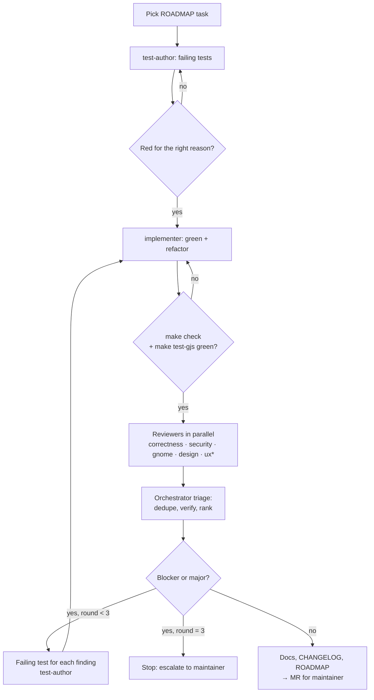

# Agent workflow: implementers and adversarial reviewers

This repository is built with Claude Code subagents under human supervision. The maintainer owns
every merge. Agents propose changes; the maintainer reads them and accepts or rejects them.

Agent definitions live in [`.claude/agents/`](../.claude/agents/) and procedures in
[`.claude/skills/`](../.claude/skills/). Start a task with the `implement-task` skill:

```text
/implement-task T02
```

## Roles

| Agent                  | Writes code? | Mandate                                                                                                                |
| ---------------------- | ------------ | ---------------------------------------------------------------------------------------------------------------------- |
| `test-author`          | tests only   | Turns acceptance criteria into failing tests (red). Cannot touch `src/`.                                               |
| `implementer`          | `src/` only  | Makes the red tests pass with the least code, then refactors with the `refactoring` skill (Fowler). Cannot edit tests. |
| `reviewer-correctness` | no           | Breaks the logic: edge cases, races, lifecycle leaks, error paths.                                                     |
| `reviewer-security`    | no           | Threat model: argv injection, path handling, untrusted JSON, resource exhaustion.                                      |
| `reviewer-gnome`       | no           | EGO review guidelines, GNOME 46–50 API availability, main-loop discipline.                                             |
| `reviewer-design`      | no           | Architecture boundaries, simplicity, naming, "less is more", test quality.                                             |
| `reviewer-ux`          | no           | HIG, minimal UI, accessibility, i18n, copy. Only for `ui/` and `prefs.ts`.                                             |

Splitting test authorship from implementation is deliberate. The implementer cannot weaken the
specification to make it pass, and the test author cannot shape tests around an implementation
they have already seen.

## Pipeline



\* `reviewer-ux` runs only when `src/ui/`, `src/prefs.ts`, `data/stylesheet.css` or user-visible
strings changed.

## Adversarial rules

- Reviewers assume the change is wrong until they fail to prove it. Each finding must include a
  **concrete failure scenario** (inputs or state → wrong result) and a file:line anchor. If they
  can, they also propose a failing test.
- Severity:
  - **blocker**: wrong behaviour, crash, leak after `disable()`, EGO rejection, security issue.
  - **major**: likely bug under realistic conditions, boundary violation, missing test for a
    branch, an API that is not verified on GNOME 46.
  - **minor**: clarity, naming, small simplification.
  - **nit**: taste. Reported at most once each, and never blocking.
- The orchestrator **verifies** every blocker and major before acting on it: reproduce with a
  test or read the code path. Unverifiable findings are dropped and noted as such.
- The implementer may rebut a finding once, with evidence. The reviewer who raised it rules on
  the rebuttal. If they still disagree, the maintainer decides.
- No reviewer sees another reviewer's report before submitting their own. This keeps findings
  independent.
- Three fix rounds at most. Then stop and escalate: repeated failure means the design needs a
  human.

## Isolation

- Implementers run with `isolation: "worktree"` so parallel tasks cannot interfere. Tasks whose
  dependencies are done (for example T07 and T08) may run in parallel.
- Reviewers are read-only (`Read`, `Grep`, `Glob`, and `Bash` limited to running checks).

## What agents must never do

- Commit, push, tag, or touch CI variables. The maintainer does that.
- Edit `LICENSE`, CI files (`.github/`, `.gitlab-ci.yml`), `debian/`, `Makefile`, `eslint.config.js`, `tsconfig*.json` or coverage thresholds
  without an explicit instruction in the task.
- Leave prompt-like comments, apologies, or "as an AI" text in code or commits.
- Add dependencies. The runtime has none, and dev dependencies change only by maintainer decision.
