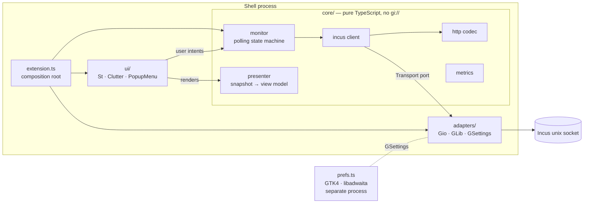

# Architecture

Incus Monitor is a GNOME Shell extension (GNOME 46–50) that shows the local Incus host's
instances in the top bar, with their state and resource usage, and lets the user run lifecycle
actions on them.

It uses a **ports-and-adapters** (hexagonal) design. All decision-making lives in a pure
TypeScript core that runs unchanged under Node (unit tests) and GJS (the shell). Everything that
touches GLib, Gio, St, Clutter or GTK sits at the edge, and those edge modules are kept thin.



## Layers and dependency rule

Dependencies point **inward only**. ESLint (`no-restricted-imports`, see `eslint.config.js`)
enforces this, so a violation fails CI.

| Layer           | May import                                        | Must not import                       | Tested by                   |
| --------------- | ------------------------------------------------- | ------------------------------------- | --------------------------- |
| `src/core/`     | other `core/` modules, ES2023 built-ins           | `gi://*`, `resource://*`, GJS globals | Vitest (Node), ≥95 % branch |
| `src/adapters/` | `core/`, `gi://Gio`, `gi://GLib`, `gi://GObject`  | `ui/`, Shell or GTK libraries         | GJS integration tests       |
| `src/ui/`       | `core/` (types, presenter), Shell libraries       | `adapters/`, GTK/Gdk/Adw              | Nested shell, manual matrix |
| `extension.ts`  | everything above                                  | GTK/Gdk/Adw                           | Nested shell                |
| `prefs.ts`      | `core/` types, `gi://Adw`, `gi://Gtk`, `gi://Gio` | St, Clutter, Meta, Shell, `ui/`       | Manual                      |

## Module map (target for v1.0)

```text
src/
├── extension.ts            Composition root: builds the object graph in enable(), tears it down in disable().
├── prefs.ts                Adw preferences window bound to GSettings.
├── core/
│   ├── result.ts           Result<T, E> and helpers. No exceptions cross module boundaries.
│   ├── errors.ts           IncusError: a tagged union of every failure the UI can explain.
│   ├── cancel.ts           CancelSignal / CancelSource: cancellation without AbortController (absent in GJS).
│   ├── ports.ts            Interfaces implemented by adapters: SocketProbe, Transport, Clock, Launcher, Clipboard.
│   ├── http/
│   │   ├── request.ts      Serialise an HTTP/1.1 request (Host, Connection: close, JSON body).
│   │   └── response.ts     Parse an HTTP/1.1 response: status, headers, Content-Length, chunked.
│   ├── incus/
│   │   ├── envelope.ts     Decode sync / async / error envelopes.
│   │   ├── models.ts       Validated domain types: Server, Instance, InstanceState.
│   │   ├── decode.ts       Hand-written decoders from unknown JSON (no runtime deps).
│   │   ├── validate.ts     Name and path validators, text sanitisers shared by decoders and client.
│   │   ├── compat.ts       Required api_extensions and supported server versions.
│   │   └── client.ts       IncusClient: server info, list instances, change state, wait for an operation.
│   ├── socket.ts           Socket candidate discovery (system socket, incus-user socket).
│   ├── metrics.ts          CPU %, memory, network rates from successive samples.
│   ├── format.ts           Human-readable sizes, rates and durations (locale and gettext injected).
│   ├── monitor.ts          State machine + scheduling (idle/slow vs open/fast cadence, back-off), compat check, socket discovery re-run, `perform`.
│   └── presenter.ts        Snapshot → ViewModel (sorting, labels, available actions, empty/error states).
├── adapters/
│   ├── gio-transport.ts    Transport over Gio.SocketClient + Gio.UnixSocketAddress, cancellable.
│   ├── glib-clock.ts       Clock over GLib.timeout_add; every source is tracked and removable.
│   ├── settings.ts         Typed GSettings wrapper with change subscription.
│   ├── socket-probe.ts     Classifies socket paths (missing / denied / usable) with Gio, without connecting.
│   ├── launcher.ts         Terminal detection and Gio.Subprocess spawn (argv only, never a shell string).
│   └── clipboard.ts        St.Clipboard write (explicit user action only).
└── ui/
    ├── indicator.ts        PanelMenu.Button: icon + optional running count.
    ├── instance-item.ts    One row per instance; expands into details and actions.
    ├── state-item.ts       Empty / error / unsupported states with a single actionable hint.
    └── footer.ts           Refresh and Preferences buttons.
```

The map is a target, not a contract. If a task shows that a module should be split or merged,
update this file in the same merge request.

## Runtime flow

1. `enable()` reads settings, builds the adapters, the `IncusClient`, the `Monitor` and the
   `Indicator`, and adds the indicator to the panel.
2. The `Monitor` resolves a socket (see [INCUS_API.md](INCUS_API.md#sockets)), checks
   compatibility once, then polls:
   - **menu closed**: `GET /1.0/instances?all-projects=true&recursion=1` every `refresh-interval`
     seconds (default 10). This is enough for states and the running count.
   - **menu open**: refresh immediately, then `recursion=2` every 2 s for live metrics.
   - **on error**: exponential back-off (2 s → 60 s), reset on the first success.
3. Each poll produces an immutable `Snapshot`. The presenter maps it to a `ViewModel`, and the UI
   re-renders only the rows whose view model changed (structural equality).
4. User intents (start, stop, …) go to `Monitor.perform(action, instance)`. It issues
   `PUT …/state`, waits for the operation, refreshes, and returns a `Result` that the UI turns
   into a notification on failure.
5. `disable()` cancels in-flight I/O (`Gio.Cancellable`), removes every main-loop source,
   disconnects every signal, destroys the indicator, and drops all references.

## Key decisions

Recorded as ADRs in [`docs/adr/`](adr/README.md):

- [ADR-0001](adr/0001-gnome-46-to-50-esm-only.md): GNOME 46–50 only, ES modules, no legacy branch.
- [ADR-0002](adr/0002-typescript-with-girs.md): TypeScript compiled with `tsc`, no bundler.
- [ADR-0003](adr/0003-raw-http-over-gio-unix-socket.md): raw HTTP/1.1 over the unix socket via Gio.
- [ADR-0004](adr/0004-polling-not-events.md): adaptive polling rather than the events websocket.
- [ADR-0005](adr/0005-ports-and-adapters.md): pure core, thin adapters, lint-enforced.
- [ADR-0006](adr/0006-adwaita-icons-only.md): Adwaita symbolic icons only, no Incus logo.
- [ADR-0007](adr/0007-incus-6-and-7-lts.md): Incus 6.0 LTS and 7.0 LTS, feature-detected.
- [ADR-0008](adr/0008-two-tier-testing.md): Vitest for core, GJS harness for adapters.
- [ADR-0009](adr/0009-incus-for-reproducible-local-builds.md): Incus for clean local builds and desktop VMs.
- [ADR-0010](adr/0010-distribution-deb-and-ppa.md): one build for all series; zip, .deb, private PPA.
- [ADR-0011](adr/0011-release-from-conventional-commits.md): changelog and versions from commits.
- [ADR-0012](adr/0012-cancel-signal-and-total-ports.md): core cancellation signal; ports never reject.
